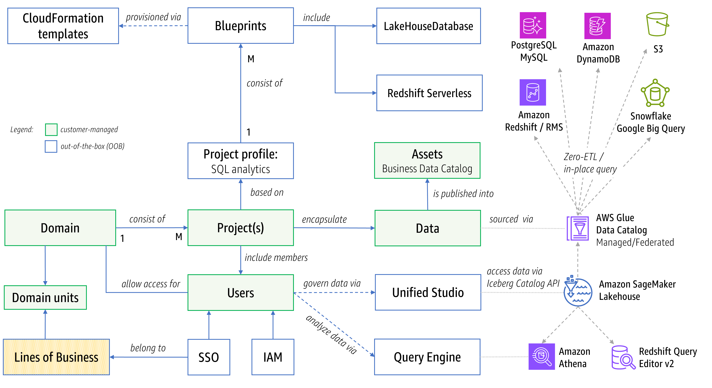
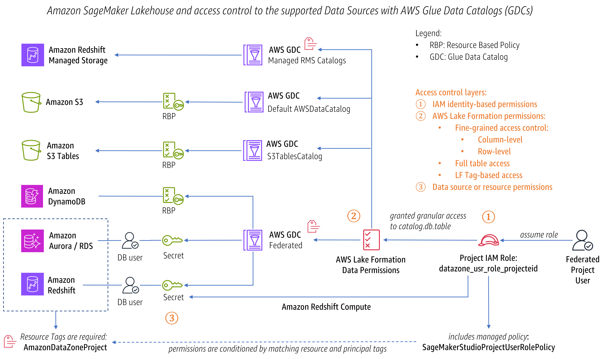
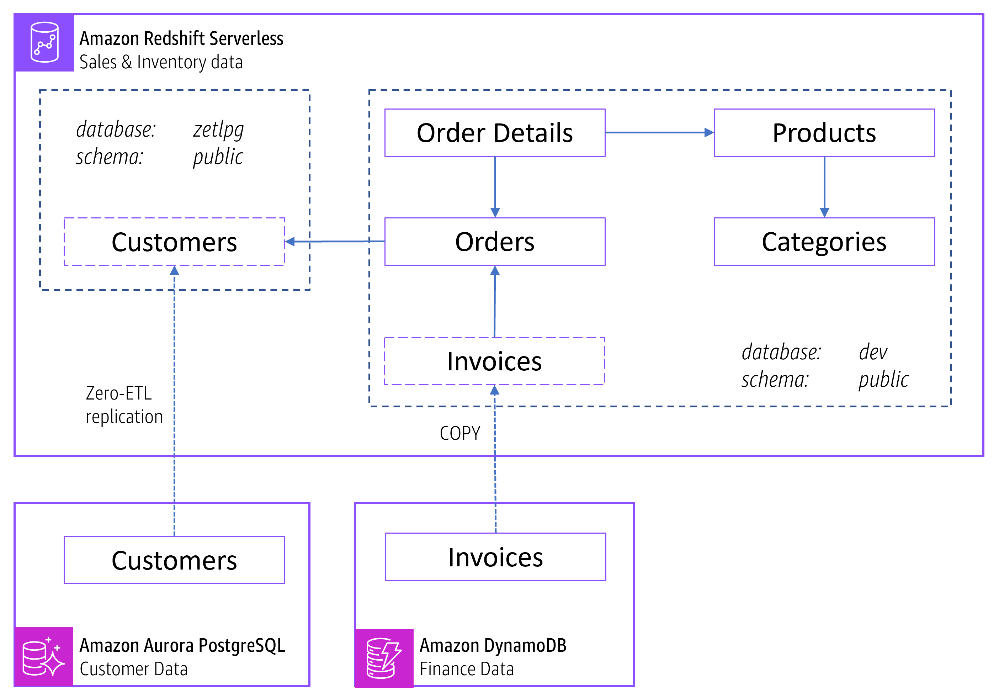
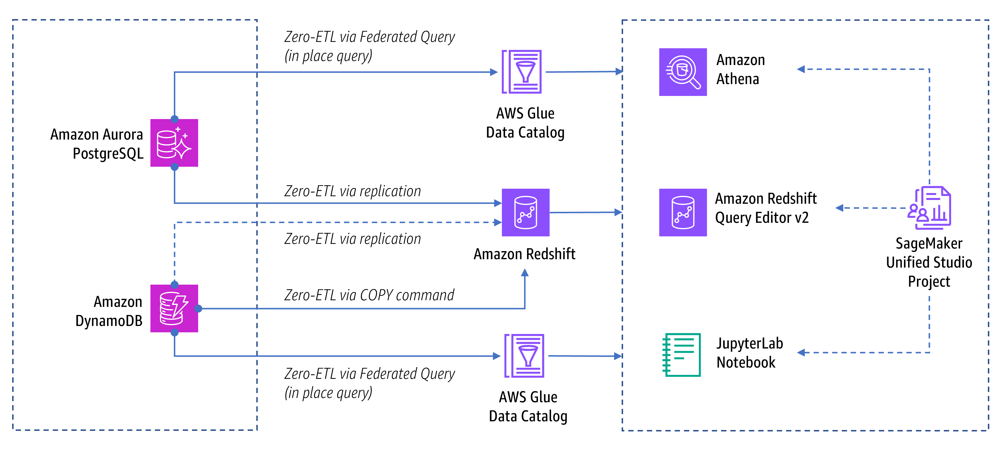
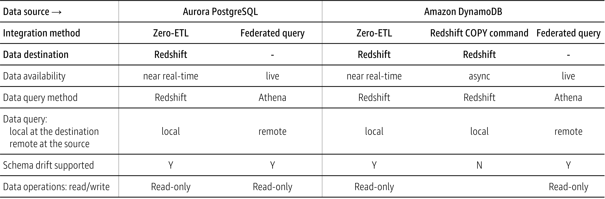
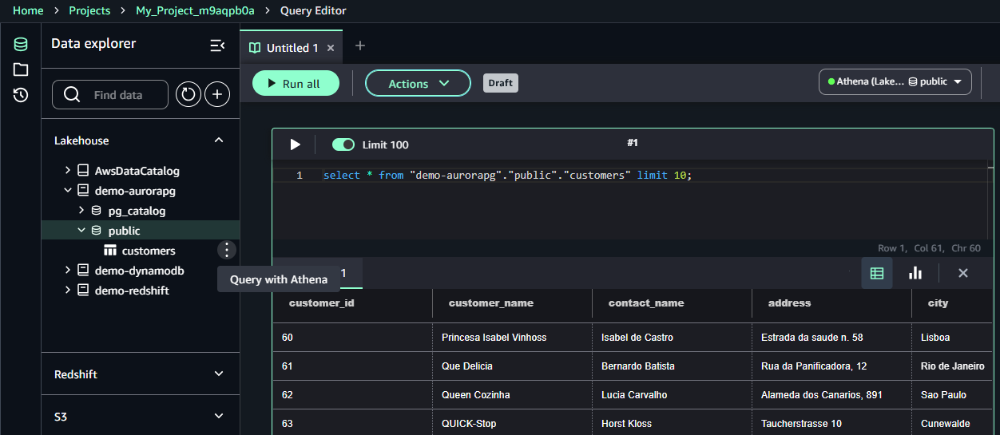

# Demystifying Data Analytics in Amazon SageMaker Unified Studio
> [!NOTE]
> - Mental Model to understand the structure of Amazon SageMaker Unified Studio and Amazon SageMaker Lakehouse in no time
> - Quick Start demo provisioned through CloudFormation resources

## Amazon SageMaker Unified Studio

[Amazon SageMaker Unified Studio](https://aws.amazon.com/sagemaker/unified-studio/) provides an integrated environment for domain-specific data projects. The environment is provisioned through AWS-managed blueprints powered by CloudFormation templates and organized into specialized projects ranging from SQL analytics, data exploration and processing, AI model development and training to GenAI applicarion development.

Users authenticated via IAM or SSO can work within these projects to unlock the value of data by:
- Connecting multiple data sources, including [Amazon S3 data lakes](https://aws.amazon.com/big-data/datalakes-and-analytics/datalakes/), [Amazon Redshift data warehouses and managed storage](https://docs.aws.amazon.com/redshift/latest/dg/c_high_level_system_architecture.html), and federated sources
- Unifying these sources through the [Amazon SageMaker Lakehouse](https://aws.amazon.com/sagemaker/lakehouse/) and registering in [the technical data catalogs](https://docs.aws.amazon.com/prescriptive-guidance/latest/serverless-etl-aws-glue/aws-glue-data-catalog.html)
- Analyzing data using query engines like Amazon Athena or Amazon Redshift Query Editor v2, or exploring and processing data programmatically using [JupyterLab Notebooks](https://docs.aws.amazon.com/sagemaker-unified-studio/latest/userguide/jupyterlab.html)
- Leveraging Generative SQL by interacting with a chatbot powered by Amazon Q and asking natural language questions in order to understand the actionable context of domain data and create SQL queries
- Governing unified and shared data access through assets exposed via [a business catalog](https://docs.aws.amazon.com/sagemaker-unified-studio/latest/userguide/working-with-business-catalog.html)

Projects in Amazon SageMaker Unified Studio also serve as collaboration and permission boundaries, with consistent access policies using a single permission model with granular controls powered by AWS Lake Formation.

Amazon SageMaker Unified Studio makes it easy for customers to find and access data from across their organization and brings together purpose-built [AWS analytics](https://aws.amazon.com/big-data/datalakes-and-analytics/) and [AI/ML capabilities](https://aws.amazon.com/ai/#services) so that customers can act on their data using the best tool for the job across all types of common data use cases. With built-in Amazon Q Developer assistance, teams can accelerate their data projects through AI-powered guidance and intelligent SQL recommendations.

## Amazon SageMaker Lakehouse

[Amazon SageMaker Lakehouse](https://aws.amazon.com/sagemaker/lakehouse/) is a capability that unifies data across Amazon S3 data lakes, Amazon Redshift data warehouses and operational databases, enabling you to build powerful analytics and AI/ML applications on a single copy of data, while eliminating data silos, and accelerating time-to-insight through cohesive data access across your organization.  

[Amazon SageMaker Lakehouse](https://aws.amazon.com/sagemaker/lakehouse/) offers three major benefits:
- **Unified and consistent data access** - Amazon SageMaker Lakehouse uses a technical data catalog powered by AWS Glue Data Catalog as the primary interface for interaction with selected data sources.
- **Centralized permission control** - Amazon SageMaker Lakehouse supports fine-grained access control to your data, regardless of the underlying storage formats or query engines used.
- **Open source compatibility** - Amazon SageMaker Lakehouse leverages open-source Apache Iceberg, enabling data interoperability across various Apache Iceberg compatible query engines and tools. Data in SageMaker Lakehouse can be accessed from [Apache Iceberg](https://aws.amazon.com/what-is/apache-iceberg/) compatible engines such as [Amazon Athena](https://aws.amazon.com/athena), Apache Spark, or Amazon EMR.

Amazon SageMaker Lakehouse provides consistent approach to establish [data connection](https://docs.aws.amazon.com/sagemaker-unified-studio/latest/userguide/lakehouse-data-connection.html) and access new and existing data sources through data catalogs, and query data in-place using the Apache Iceberg open standard and Amazon Athena query editor. There are two types of catalogs in the Lakehouse: 
- Managed data catalogs include:
  - [Amazon S3 data lakes](https://aws.amazon.com/big-data/datalakes-and-analytics/datalakes/), including [Amazon S3 Tables](https://aws.amazon.com/blogs/aws/new-amazon-s3-tables-storage-optimized-for-analytics-workloads/) with built-in Apache Iceberg support, making it easy to query and join S3 data lake and S3 Tables with data in the lakehouse. 
  - Lakehouse catalogs backed by Redshift managed storage ([RMS catalog](https://docs.aws.amazon.com/lake-formation/latest/dg/managing-namespaces-datacatalog.html)) and compatible with Apache Iceberg table format. Also, RMS catalogs are supported destinations for Zero-ETL integration from SaaS sources (like Salesforce and SAP) and [Amazon DynamoDB](https://aws.amazon.com/dynamodb/)
- Federated data catalogs include:
  - Federated data sources, allowing you to access and analyze live data directly through lakehouse architectures. You can connect to operational databases (PostgreSQL, MySQL, Microsoft SQL Server), AWS managed databases (supported engines on Amazon Aurora and RDS, Amazon DynamoDB, Amazon DocumentDB) and third-party data sources (Snowflake, Google BigQuery) - all without moving the data. When you set up a federated data connection in Unified Studio project, AWS automatically provisions the required [infrastructure components](https://docs.aws.amazon.com/sagemaker-unified-studio/latest/userguide/lakehouse-data-connection.html#understanding-created-resources), including AWS Glue connection, AWS Glue Data Catalog, and Lambda function, which acts as a bridge between lakehouse and the federated data source.

While Amazon SageMaker Lakehouse integrates data through data catalog interface, you can still take advantage of Redshift processing power to run analytics directly on the data residing within Redshift managed storage, particularly for complex queries on massive datasets.  To work with data stored in Amazon Redshift in [Amazon SageMaker Unified Studio](https://aws.amazon.com/sagemaker/unified-studio/), you can choose from these approaches:
- Connect your existing data warehouse as a compute engine to achieve maximum performance. This approach can provide access to the entire workgroup or node, depending on your permissions. You'll have access to both native databases and auto-mounted data catalogs. Auto-mounted catalogs include the Amazon S3 data catalog (named AWSDataCatalog) and Lakehouse catalog (RMS catalog powered by Redshift Managed Storage). These catalogs are automatically discovered as external databases in your Amazon Redshift data warehouses once you establish the necessary permissions. You can work with data (read/write) and analyze it using [Redshift Query Editor v2](https://aws.amazon.com/redshift/query-editor-v2/) and Redshift SQL.
- Through [AWS Glue Zero-ETL replication](https://aws.amazon.com/what-is/zero-etl/), you can bring data from operational databases (such as Amazon Aurora, Amazon RDS for MySQL, Amazon DynamoDB), and SaaS sources (like Salesforce, SAP, Zendesk), and load data into Amazon Redshift data warehouse or Redshift managed storage in near real-time without writing any ETL job.
- Connect existing data warehouse as a federated data source through Amazon SageMaker Lakehouse.  You can select a specific native database. This database can be either local or a destination database where data is replicated through Zero-ETL. You can query data using Amazon Athena and Athena SQL. With this approach, consider performance implications of the underlying AWS Glue connection and Lambda configuration.

The next Figure illustrates possible data access options supported by Amazon SageMaker Lakehouse and Amazon Redshift in context of Amazon SageMaker Unified Studio.


## Data Access control
When reading or writing data, Amazon SageMaker Lakehouse follows multiple layers of security controls. The security begins with AWS Identity and Access Management (IAM), which provides coarse-grained permissions through project-specific roles. Next, [AWS Lake Formation](https://aws.amazon.com/lake-formation) extends the foundational IAM functionality to deliver unified, fine-grained permission management across your data assets at metadata level. Lastly, resource-facing permissions complete this security architecture, using either resource-based policies or database user credentials to control access at the storage level.

[AWS Lake Formation](https://aws.amazon.com/lake-formation) provides a central permission store for data sources registered in AWS Glue Data Catalog and available in Amazon SageMaker Lakehouse. Lake Formation uses Data Catalog as a unified layer for managing permissions consistently across disparate data sources: S3 data lakes, Redshift warehouses, RMS catalogs, federated data sources. It enables selected principals (such as Unified Studio project IAM role) to access catalog entities through flexible permissions ranging from full access to fine-grained controls at the column, row, and cell levels. This permission model is enforced consistently across AWS analytics and machine learning services, including Amazon Athena, Amazon QuickSight, Amazon Redshift Query Editor v2, Redshift Spectrum, Amazon EMR, and AWS Glue.

When project users perform SQL analytics in Amazon SageMaker Unified Studio, their access is authorized through a project-specific IAM role (with name following this format `datazone_usr_role_{ProjectID}_{EnvironmentID}`). This role incorporates the AWS-managed policy **SageMakerStudioProjectUserRolePolicy**, which manages broad permission sets for data lake, data warehouse, catalog resources and more. Connection to existing data sources requires the presence of specific tags on the secrets in AWS Secrets Manager — such as **AmazonDataZoneProject** — to activate the project permissions defined in the **SageMakerStudioProjectUserRolePolicy** policy.

The next Figure illustrates a logical composition of this layered architecture in establishing secure access to the selected data sources:


## Demo Solution Architecture


We have demo data residing in three places:
-	Customer data in Amazon Aurora PostgreSQL
-	Sales data with the inventory data in Amazon Redshift Serverless
-	Financial data such as invoices residing in Amazon DynamoDB

To simplify provisioning resources for this blog, infrastructure components such as VPC, subnets, security groups will be reused and both Amazon SageMaker domain and data sources will be provisioned along each other. To establish connectivity with the Aurora PostgreSQL and Redshift Serverless, we will use database admin users and federate through out-of-the-box default IAM role (Project IAM Role) linked to the project in the Amazon SageMaker Unified Studio. Access to demo data sources is managed through AWS Lake Formation's default permissions model, which grants Super access to all federated data catalog tables. You can customize these permissions at the column, row, and cell levels using Lake Formation's grant/revoke mechanisms.

The next diagram illustrates these disparate data sources and explains the pathways by which data analysts can interact with these datasets after they are seamlessly integrated into Amazon SageMaker Studio.

## Demo Data Model

The following entity relationship diagram illustrates a typical data landscape where interconnected data of varying formats and types can be distributed across multiple lines of business, but easily united into cohesive data lakes through lakehouse.  
-	Customer data representing well-structured entities with complex relationships 
-	Sales and inventory data is optimized for analytics and data warehousing, to maintain large-scale reporting and complex queries 
-	Financial data like invoices often stored as semi-structured NoSQL format designed for high-performance, scalability
-	


## Zero-ETL integrations
In this demo we will cover the following zero-ETL integration options:
-	Federated Query of data in Amazon Aurora and Amazon DynamoDB through Amazon Athena. This direction queries data in-place at the source through a built-in connector without moving data.
-	Zero-ETL replication from [Amazon Aurora PostgreSQL](https://aws.amazon.com/rds/aurora/zero-etl/) based on a specified interval, automatically replicating data to the designated destination database and available for querying within Amazon Redshift.
  -	Additionally, you can also configure near real-time Zero-ETL replication from Amazon DynamoDB to the destination database.
-	Zero-ETL replication from Amazon DynamoDB into Amazon Redshift Serverless by running the [COPY command](https://docs.aws.amazon.com/amazondynamodb/latest/developerguide/RedshiftforDynamoDB-copy-data.html)



Here is the feature comparison of Zero-ETL options in context of Amazon SageMaker Unified Studio:



## Deployment

### Prerequisites

Complete the following steps within [AWS Management Console](https://console.aws.amazon.com/):
1.	Register current user as [Data Lake Administrator](https://docs.aws.amazon.com/lake-formation/latest/dg/how-it-works-terminology.html#terminology-admin) in the AWS Lake Formation. This will be required to manage and apply additional fine-grained permissions
2.	Create Amazon SageMaker Domain:
-	Open AWS Management console and navigate to Amazon SageMaker 
-	Create a Unified Studio domain
-	Select Quick Setup and select a VPC with 3 subnets. It is recommended to Create VPC for Amazon SageMaker. The underlying CloudFormation template automatically provisions a properly-configured VPC with the necessary VPC endpoints.
-	Create an IAM Identity Center user with a select email and accept the invitation to activate the user account
-	Once the domain is created, copy the Amazon SageMaker Unified Studio URL: `https://{domain_id}.sagemaker.{region}.on.aws/` 
3. Complete the following steps within Amazon SageMaker Unified Studio
-	Open Amazon SageMaker Unified Studio URL https://{domain_id}.sagemaker.{region}.on.aws/ and login as a selected user 
-	Create a project with the project profile: All Capabilities. This project profile enables Data analytics and AI/ML model and app development.
-	Once the project is ready, go to the project overview and copy Project ID and Project IAM Role ARN: datazone_usr_role_{ProjectID}_{EnvironmentID}
4. Collect the following inputs which will be required for deploying the CloudFormation template:
-	VPC ID where we provisioned SageMaker Domain
-	Subnet IDs
-	Security Group ID from Security Group with name datazone-{ProjectID}-dev
-	Project ID
-	Project IAM Role ARN

### Deployment

1.	Deploy provided CloudFormation Templates: [StackSMUSDataSources.yaml](cloudformation/StackSMUSDataSources.yaml) and specify parameters. If you have not created VPC as part of Domain setup, then run [StackSMUSVPCEndpoints.yaml](cloudformation/StackSMUSVPCEndpoints.yaml) to create necessary VPC Endpoints: STS, Secrets Manager, Glue, RDS Data, Redshift Data, Redshift Serverless Interface endpoints and S3 Gateway endpoint.
2.	Review Output parameters

### Post Deployment
1.	In AWS Mngt Console, go to [Amazon SageMaker AI](https://console.aws.amazon.com/sagemaker/home?#/notebooks-and-git-repos), open the provisioned notebook and run scripts in [InitDataSources.ipynb](InitDataSources.ipynb) to init Aurora PostgreSQL and DynamoDB
2.	In AWS Mngt Console, go to [Amazon SageMaker](https://console.aws.amazon.com/datazone/home?#/domains), open Domain URL, login into Amazon SageMaker Unified Studio and go to the previously created Project
3.  Open Data tab, click on '+' and then choose Add Data → Add Connection → Select connection type and specify configuration parameters where {x} are located in the CloudFormation Outputs:

| Connection Type  | Configuration parameters ({x} from CloudFormation Outputs) |
| ------------- | ------------- |
| Amazon Aurora PostgreSQL | Name: demo-aurorapg <br> Host: {AuroraPGHost} <br> Port: {AuroraPGPort} <br> Database: {AuroraPGDatabase} <br> Authentification : AWS Secrets Manager: {AuroraPGSecretArn} |
| Amazon Redshift Serverless  | Name: demo-redshift <br> Host: {RedshiftHost} <br> Port: {RedshiftPort} <br> Database: {RedshiftDatabase} <br> Authentification : AWS Secrets Manager: {RedshiftSecretArn} |
| Amazon DynamoDB | Name: demo-dynamodb |
   
5.	Open Compute tab and connect the existing compute resource:
- Add Compute → Connect to existing compute resources → Amazon Redshift Serverless
- Endter the following configuration parameters:
- On **demo-wg.redshift** compute details page, select *Actions* → *Open Query Editor* and ensure selected data source in the right top corner is *Redshift (demo-wg.redshift) → dev → public*
- Run DDL + DML from [redshift.sql](sql/redshift.sql) to populate data in the redshift local dev database

| Compute Type | Configuration parameters (from CloudFormation Outputs) |
| ------------- | ------------- |
| Amazon Redshift Serverless | Redshift compute: demo-wg <br/> Authentication : AWS Secrets Manager: {RedshiftSecretArn} <br/> Name: demo |


### Create Zero-ETL Integrations
#### Zero-ETL Integration between Redshift and Aurora PostgreSQL
Open Query Editor and select connection to the custom Redshift compute
- Run the following commands to create zero-etl database
```sql
SELECT integration_id FROM SVV_INTEGRATION;
-- copy integration_id
CREATE DATABASE "zetlpg" FROM INTEGRATION 'integration_id' DATABASE "postgres";
```
#### Zero-ETL Integration between Redshift and DynamoDB
- Copy Invoices data from Amazon DynamoDB into Redshift by running the following commands:
```sql
CREATE TABLE invoices (
order_id integer not null,
invoice_number varchar(200) not null,
total integer not null,
status varchar(10) not null,
primary key(invoice_number)
);
COPY invoices from 'dynamodb://invoices'
IAM_ROLE default
readratio 50;
```


## SQL Analytics via Redshift Query Editor v2

Open SageMaker Unified Studio project and navigate to the Build → Query Editor. Open new Querybook tab and select Redshift connection pointing to our custom compute demo-wg.redshift:
-	Connection: Redshift (demo-wg.redshift) | Database: dev | Schemas: public

Enter the following SQL to find an answer: `what are top 5 customers with maximum orders?`

Below SQL command joins tables from local database (public) with the customer table from Zero-ETL originated database (zetlpg) where data is being replicated from Amazon Aurora PostgreSQL database via Zero-ETL integration.

```sql
SELECT
  o.customer_id, c.customer_name,
  SUM(od.quantity) AS total_quantity
FROM
  public.orders o
  JOIN public.order_details od ON o.order_id = od.order_id
  JOIN public.products p ON od.product_id = p.product_id
  JOIN "zetlpg"."public"."customers" c ON c.customer_id = o.customer_id
GROUP BY
  o.customer_id, c.customer_name
ORDER BY
  total_quantity DESC
LIMIT
  5;
```
Review the results:


### Generative SQL

Ensure that you selected Redshift connection pointing to our custom compute demo-wg.redshift:
-	Connection: Redshift (demo-wg.redshift) | Database: dev | Schemas: public

Next, open Amazon Q and type the following question: `What are the most ordered products?`

Amazon Q will generate SELECT statement similar to this one:

```sql
SELECT
  p."product_name",
  SUM(od."quantity") AS "total_quantity"
FROM
  public.products p
  JOIN public.order_details od ON p."product_id" = od."product_id"
GROUP BY
  p."product_name"
ORDER BY
  "total_quantity" DESC;
```
Click 'Add to querybook' and execute to confirm the results.


**Question:** *Identify all product categories associated with invoices that are currently in draft status. Include the outstanding amounts for these invoices.*

Amazon Q will generate SELECT statement similar to this one:

```sql
SELECT
  c."category_name",
  SUM(i."total") AS "outstanding_amount"
FROM
  "public"."categories" c
  JOIN "public"."products" p ON c."category_id" = p."category_id"
  JOIN "public"."order_details" od ON p."product_id" = od."product_id"
  JOIN "public"."invoices" i ON od."order_id" = i."order_id"
WHERE
  i."status" = 'DRAFT'
GROUP BY
  c."category_name";
```

**Questions:** *Show a list of customers with unpaid invoices? Statuses of unpaid invoises are SUBMITTED and AUTHORISED*

Amazon Q will generate SELECT statement similar to this one:

```sql
SELECT DISTINCT
  o.customer_id
FROM
  "public".orders o
  JOIN "public".invoices i ON o.order_id = i.order_id
WHERE
  i.status IN ('SUBMITTED', 'AUTHORISED');
```

## SQL Analytics via Amazon Athena

Now let’s query the federated data sources such as Amazon DynamoDB, Aurora PostgreSQL, Redshift Serverless. Once connections to the federated sources are established successfully, expand connection, select target table and click on '⋮' to query with Amazon Athena as shown on the screenshot below.



Here are sample queries to try:
```sql
select * from "demo-aurorapg"."public"."customers" limit 10;
select * from "demo-redshift"."public"."invoices" limit 10;
select * from "demo-dynamodb"."default"."invoices" limit 10;
```

### Connecting to Snowflake

Create demo warehouse, user, role and sample data by running these commands in Snowflake:

```sql
-- Create warehouse
CREATE WAREHOUSE "demo_wh" WITH 
    WAREHOUSE_SIZE = 'X-SMALL'
    MIN_CLUSTER_COUNT = 1
    MAX_CLUSTER_COUNT = 1
    AUTO_SUSPEND = 600  -- 10 minutes
    AUTO_RESUME = TRUE
    INITIALLY_SUSPENDED = TRUE
    SCALING_POLICY = 'STANDARD';

-- Grant usage
GRANT USAGE ON WAREHOUSE "demo_wh" TO ROLE PUBLIC;

-- Create a specific role
CREATE ROLE demo_role;

-- Create user
CREATE USER demo_user
    PASSWORD = '******'  -- use a strong password
    DEFAULT_ROLE = demo_role
    DEFAULT_WAREHOUSE = "demo_wh"
    MUST_CHANGE_PASSWORD = FALSE;

-- Assign the role to user
GRANT ROLE demo_role TO USER demo_user;

-- Grant warehouse access
GRANT USAGE ON WAREHOUSE "demo_wh" TO ROLE demo_role;

--ALTER USER demo_user SET DEFAULT_WAREHOUSE = "demo_wh";

CREATE DATABASE "demo_db";
CREATE SCHEMA "demo_schema";

-- Create customer table
CREATE TABLE "demo_db"."demo_schema"."customer" (
    "customer_id" INTEGER,
    "first_name" VARCHAR(50),
    "email" VARCHAR(100),
    "city" VARCHAR(50),
    "total_orders" INTEGER
);

-- Insert sample data
INSERT INTO "demo_db"."demo_schema"."customer" 
VALUES 
    (1, 'John', 'john.doe@email.com', 'New York', 5),
    (2, 'Emma', 'emma.smith@email.com', 'Los Angeles', 3),
    (3, 'Michael', 'michael.brown@email.com', 'Chicago', 7),
    (4, 'Sarah', 'sarah.wilson@email.com', 'Houston', 2),
    (5, 'David', 'david.lee@email.com', 'Seattle', 4),
    (6, 'Lisa', 'lisa.anderson@email.com', 'Boston', 6),
    (7, 'James', 'james.taylor@email.com', 'Miami', 1),
    (8, 'Maria', 'maria.garcia@email.com', 'Denver', 8),
    (9, 'Robert', 'robert.miller@email.com', 'Phoenix', 3),
    (10, 'Jennifer', 'jennifer.davis@email.com', 'Portland', 5);

-- Grant access
GRANT USAGE ON DATABASE "demo_db" TO ROLE demo_role;
GRANT USAGE ON SCHEMA "demo_db"."demo_schema" TO ROLE demo_role;
GRANT SELECT ON TABLE "demo_db"."demo_schema"."customer" TO ROLE demo_role;
```

Open Amazon SageMaker Unified Studio Project and go to Data tab. Click on '+' and then choose Add Data → Add Connection → Select connection type Snowflake  and specify configuration parameters:

| Resource Type  | Configuration parameters |
| ------------- | ------------- |
| Secret Manager | Name: demo_user <br> USERNAME: demo_user  <br> PASSWORD: ******  |
| Snowflake Connection in Unified Studio | Name: demo-snowflake <br> Host: {account}.snowflakecomputing.com <br> Port: 443 <br> Database: demo_db <br> Warehouse: demo_wh <br> Authentification : AWS Secrets Manager: demo_user |

Once connection is established successfully, expand connection, select target table and click on '⋮' to query with Amazon Athena

## References
[Amazon SageMaker Unified Studio](https://aws.amazon.com/sagemaker/unified-studio/)

[Amazon SageMaker Lakehouse](https://aws.amazon.com/sagemaker/lakehouse/)

[What is zero-ETL?](https://aws.amazon.com/what-is/zero-etl/)

[Amazon DynamoDB Zero-ETL integrations](https://aws.amazon.com/dynamodb/integrations/)

### Feature releases
[Amazon DynamoDB zero-ETL integration with Amazon SageMaker Lakehouse](https://aws.amazon.com/about-aws/whats-new/2024/12/amazon-dynamo-db-zero-etl-integration-sagemaker-lakehouse/)

[Amazon DynamoDB zero-ETL integration with Amazon Redshift](https://aws.amazon.com/about-aws/whats-new/2024/10/amazon-dynamodb-zero-etl-integration-redshift/)

[Amazon Aurora PostgreSQL zero-ETL integration with Amazon Redshift](https://aws.amazon.com/about-aws/whats-new/2024/10/amazon-aurora-postgresql-zero-etl-integration-redshift-generally-available/)
