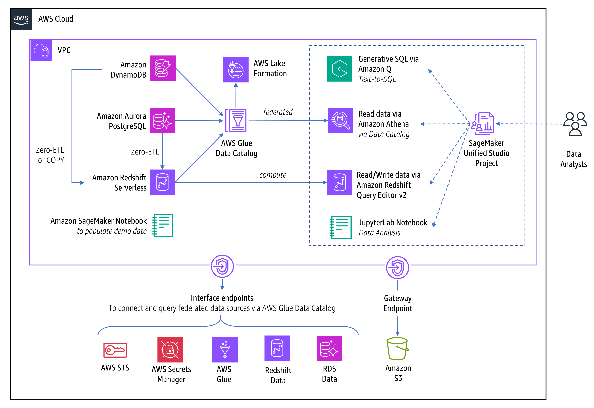

# Demystifying Data Analytics in Amazon SageMaker Unified Studio
> [!NOTE]
> Quick Start with demo CloudFormation resources
## Amazon SageMaker Lakehouse

**Amazon SageMaker Lakehouse** is a capability that unifies data across Amazon S3 data lakes, Amazon Redshift data warehouses and Redshift managed storage (RMS catalogs), enabling you to build powerful analytics and AI/ML applications on a single copy of data. In addition to seamlessly accessing data from these sources, you can connect to operational databases and third-party data sources and query data in-place with federated query capabilities. Through AWS Glue zero-ETL replication, you can bring data from operational databases (such as Amazon Aurora, Amazon RDS for MySQL, Amazon DynamoDB), and SaaS sources (like Salesforce and SAP), and load data into Amazon Redshift data warehouse or Redshift managed storage without writing any ETL job.

Amazon SageMaker Lakehouse offers three major benefits:

- **Unified data access** - Amazon SageMaker Lakehouse uses a technical data catalog powered by AWS Glue Data Catalog as the primary interface for interaction with selected data sources.
- **Integrated access control** - Amazon SageMaker Lakehouse supports fine-grained access control to your data, regardless of the underlying storage formats or query engines used.
- **Open source compatibility** - Amazon SageMaker Lakehouse leverages open-source Apache Iceberg, enabling data interoperability across various Apache Iceberg compatible query engines and tools. Data in SageMaker Lakehouse can be accessed from Apache Iceberg–compatible engine such as Apache Spark, Athena, or Amazon EMR.

There are two ways to connect to Amazon Redshift data warehouse:
- As a federated data source, connecting to a selected native database that can be either a local database or a destination database where data is replicated through zero-ETL.
- As a compute engine to execute queries, providing access to the entire workgroup/node with both native databases and auto-mounted data catalogs such as AWSDataCatalog and Redshift Managed Storage (RMS). These catalogs are automatically discovered as external databases in Amazon Redshift data warehouses once the necessary permissions are established. This allows you to analyze lakehouse data using Redshift Query Editor v2. 

## Demo Solution Architecture


We have demo data residing in three places:
-	Customer data in Amazon Aurora PostgreSQL
-	Sales data with the inventory data in Amazon Redshift Serverless
-	Financial data such as invoices residing in Amazon DynamoDB

For simplicity of demo provisioning, infrastructure resources such VPC, subnets, security groups will be reused and both Amazon SageMaker domain and data sources will be provisioned along each other. Connectivity to the data sources will be achieved using admin database users and federated through out-of-the-box project role.

Data access is restricted by applying fine-grained permissions using AWS Lake Formation.

## Demo Data Model


## Zero-ETL integrations
In this post we will cover the following zero-ETL integration options:
-	Federated Query of data in Amazon Aurora and Amazon DynamoDB through Amazon Athena. This direction queries data in place
-	Zero-ETL replication from Amazon Aurora and Amazon DynamoDB based on a given interval automatically. This direction queries replicated data within Amazon Redshift
-	Zero-ETL replication from Amazon DynamoDB by running COPY command
-	


## Deployment

### Prerequisites

These prerequisites must be completed in AWS Management Console
1.	Register current user as Lake Formation admin. This will be required to manage and apply additional fine-grained permissions
2.	Create Amazon SageMaker Domain in AWS Mngt console
- Open AWS Mngt console and go to Amazon SageMaker
- Create a Unified Studio domain
- Select Quick Setup and select VPC with 3 subnets.
- Create IAM Identity Center user with a given email and accept invitation to activate user
- Copy Amazon SageMaker Unified Studio URL

Next steps must be completed from Amazon SageMaker Unified Studio
- Open Amazon SageMaker Unified Studio URL and login as given user
- Create project with project profile: Data analytics and AI-ML model development
- Go to Project overview and copy Project ID and Project IAM Role ARN containing: datazone_usr_role_{ProjectID}_{EnvironmentID}

### Deployment

1.	Collect the following inputs which will be required as inputs in the CloudFormation template:
- [x] VPC ID where we provisioned SageMaker Domain
- [x] Subnet IDs
- [x] Security Group ID from Security Group with name datazone-{ProjectID}-dev
- [x] Project ID
- [x] Project IAM Role ARN
2.	Deploy provided CloudFormation Templates: [StackSMUSDataSources.yaml](cloudformation/StackSMUSDataSources.yaml), [StackSMUSVPCEndpoints.yaml](cloudformation/StackSMUSVPCEndpoints.yaml)  and specify parameters
3.	Review Output parameters

### Post Deployment
1.	In AWS Mngt Console, go to Amazon SageMaker AI, open the provisioned notebook and run scripts in [InitDataSources.ipynb](InitDataSources.ipynb) to init Aurora PostgreSQL and DynamoDB
2.	In AWS Mngt Console, go to Amazon SageMaker, open Domain URL, login into Amazon SageMaker Unified Studio and go to the previously created Project
3.	Open Compute tab and connect to existing compute resource:
- Add Compute → Connect to existing compute resources → Amazon Redshift Serverless
- Endter the following configuration parameters:

| Compute Type | Configuration parameters (from CloudFormation Outputs) |
| ------------- | ------------- |
| Amazon Redshift Serverless | Redshift compute: demo-wg <br/> Authentication : AWS Secrets Manager: {RedshiftSecretArn} <br/> Name: demo |
3. On **demo-wg.redshift** compute details page, select *Actions* → *Open Query Editor* and ensure selected data source in the right top corner is *Redshift (demo-wg.redshift) → dev → public*
4. Run DDL + DML from [redshift.sql](sql/redshift.sql) to populate data in the redshift local dev database

### Create Zero-ETL Integrations
#### Zero-ETL Integration between Redshift and Aurora PostgreSQL
Open Query Editor and select connection to the custom Redshift compute
- Run the following commands to create zero-etl database
```sql
SELECT integration_id FROM SVV_INTEGRATION;
-- copy integration_id
CREATE DATABASE "zetlpg" FROM INTEGRATION 'integration_id' DATABASE "postgres";
```
#### Zero-ETL Integration between Redshift and DynamoDB
- Copy Invoices data from Amazon DynamoDB into Redshift by running the following commands:
```sql
CREATE TABLE invoices (
customer_id integer not null,
invoice_number varchar(200) not null,
primary key(invoice_number)
)
COPY invoices from 'dynamodb://invoices'
IAM_ROLE default
readratio 50;
```


## SQL Analytics via Redshift Query Editor v2

Open Project and navigate to the Query Editor. Select Redshift connection pointing to our custom compute demo.redshift. Enter the following SQL to find an answer what are top 5 customers with maximum orders.
Below SQL command joins local tables with the customer table from replicated from Amazon Aurora PostgreSQL database to nominated Redshift database zetlpg via Zero-ETL integration.
```sql
SELECT
  o.customer_id, c.customer_name,
  SUM(od.quantity) AS total_quantity
FROM
  public.orders o
  JOIN public.order_details od ON o.order_id = od.order_id
  JOIN public.products p ON od.product_id = p.product_id
  JOIN "zetlpg"."public"."customers" c ON c.customer_id = o.customer_id
GROUP BY
  o.customer_id, c.customer_name
ORDER BY
  total_quantity DESC
LIMIT
  5;
```
Review the results:


### Generative SQL

Now open Amazon Q and type the following question: *what are the most ordered products?*

Amazon Q will generate SELECT statement similar to this one:

```sql
SELECT
  p."product_name",
  SUM(od."quantity") AS "total_quantity"
FROM
  public.products p
  JOIN public.order_details od ON p."product_id" = od."product_id"
GROUP BY
  p."product_name"
ORDER BY
  "total_quantity" DESC;
```
Click 'Add to querybook' and execute to confirm the results.


## SQL Analytics via Amazon Athena

Now lets connect federated data sources. 
In Query Editor click on '+' and Add Data – Add Connection – Select connection type and specify configuration parameters:

| Connection Type  | Configuration parameters (from CloudFormation Outputs) |
| ------------- | ------------- |
| Amazon Aurora PostgreSQL | Name: demo-aurorapg <br> Host: {AuroraPGHost} <br> Port: {AuroraPGPort} <br> Database: {AuroraPGDatabase} <br> Authentification : AWS Secrets Manager: {AuroraPGSecretArn} |
| Amazon Redshift Serverless  | Name: demo-redshift <br> Host: {RedshiftHost} <br> Port: {RedshiftPort} <br> Database: {RedshiftDatabase} <br> Authentification : AWS Secrets Manager: {RedshiftSecretArn} |

Once connections are established successfully, expand connection, select target table and click on '⋮' to query with Amazon Athena


